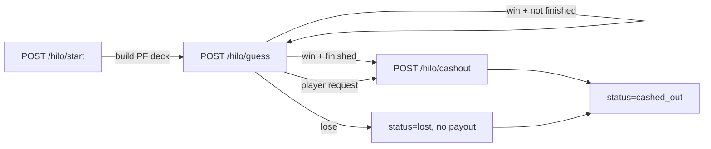

# Hi-Lo API

Provably-fair, multi-step Hi-Lo orchestration that coordinates the stateless math engine with wallets, Redis round state, and per-user locking.

## Endpoints

| Method | Path           | Description                                                                 |
| ------ | -------------- | --------------------------------------------------------------------------- |
| POST   | `/hilo/start`  | Starts a new round: debits the wallet, builds the PF deck, stores state.    |
| POST   | `/hilo/guess`  | Applies a higher/lower guess using the shared deck and updates the state.   |
| POST   | `/hilo/cashout`| Cashes out current winnings (if `step > 0`) and credits the wallet.         |
| GET    | `/hilo/round`  | Returns the active round snapshot (for reconnection / resume).              |
| GET    | `/hilo/health` | Liveness check (Postgres + Redis + wallet adapter).                         |

All mutating endpoints require `x-idempotency-key` like the Dice/CoinFlip APIs.

## Round Lifecycle

1. **Start**: Validates config + limits, enforces per-user lock, debits wallet once, writes Redis state (`hilo:round:{user}`) with TTL and PF metadata.
2. **Guess**: Pure math engine transition (`applyGuess`). No wallet movement. Marks status `lost` on busts.
3. **Cashout**: Requires `step > 0`, credits exactly once, marks status `cashed_out`, logs ledger + game history, and locks the round.

## Chain Logic

- Deck is a full 52-card PF shuffle (Fisher–Yates derived from the PF nonce).
- `maxSteps` limits the chain length; `multipliers[i]` is the total multiplier after `i+1` correct guesses.
- Rank comparisons break ties via configurable suit order.
- `finished` flag prevents extra guesses once the chain ends (loss or max steps).

## Provably-Fair Deck

- Server seed hash, client seed, and nonce are persisted with the round.
- Deck shuffling consumes deterministic floats derived from the PF context (`rollFloat(ctx, nonce + i)`).
- A complete deck is stored in state so the round can be replayed for GLI/audits.

## Money Safety Rules

- **Start**: one debit per round, wrapped in DB transaction + ledger write. Idempotency and status check prevent double debits.
- **Guess**: no wallet ops.
- **Cashout**: one credit per round, idempotent, requires `status === "active"` and `step > 0`.
- Redis lock `hilo:user-lock:{user}` guards round state mutations; wallet operations use the shared WalletRouter just like Dice/CoinFlip.

## Config Parameters

Values come from `game_configs.extra`:

| Field        | Description                                         |
| ------------ | --------------------------------------------------- |
| `maxSteps`   | Maximum chain length (1–52).                        |
| `multipliers`| Array of total multipliers per step (≥ `maxSteps`). |
| `suitOrder`  | Optional suit ranking to break equal ranks.         |

Standard config fields (`minBet`, `maxBet`, `maxPayoutPerRound`, `mathVersion`) are also enforced.

## Reconnection / Recovery

- Clients call `GET /hilo/round` after reconnecting to fetch the latest card, step, total multiplier, seeds, and timestamps.
- The Redis record TTL (2h) ensures abandon detection; expired rounds are treated as inactive and can be restarted.

